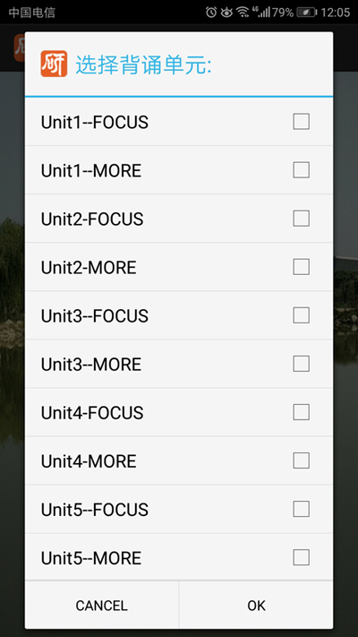

# 研究生英语综合教程上（单词）APP

   

### 研究生英语综合教程上学生用书上册高等学校研究生英语系列教材熊海虹主编 外语教学与研究出版社 研究生英语 上册

## 预览

[应用下载体验](https://raw.githubusercontent.com/WizenZhang/English-Words/master/Words/bin/Words.apk)

         

## 项目相关

### 项目环境

          

### 项目结构

```
com.english.words
    - LaunchActivity.java       启动界面
    - MainActivity.java         主界面
    - ChoiceActivity.java       选择单元界面
    - Words.java                单词数组                   
```

## 建议及问题反馈

+ E-mail: [wizen_zhang@163.com](wizen_zhang@163.com)
+ GitHub: [https://github.com/WizenZhang/English-Words/issues](https://github.com/WizenZhang/English-Words/issues)

## 致谢

感谢[APKBUS](http://www.apkbus.com/forum.php)提供的安卓源码，为本项目的形成提供了很大的帮助。

***

By [Wizen Zhang](https://wizenzhang.github.io/).
